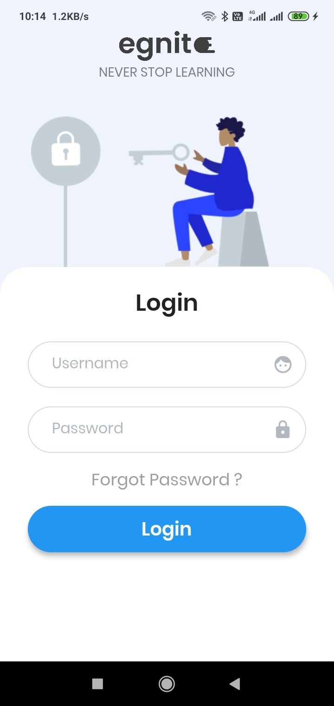
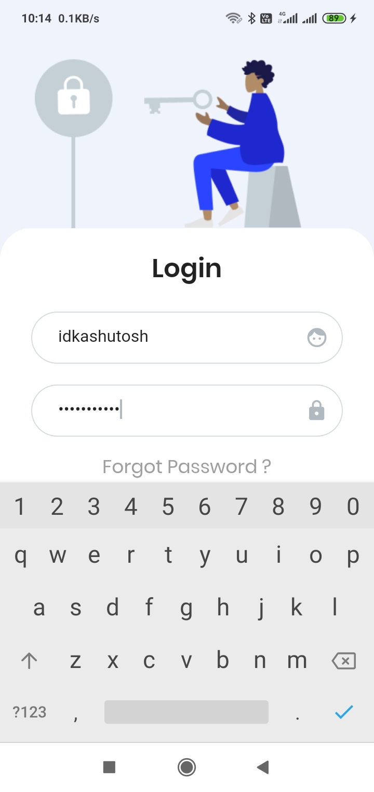

# Login Screen UI
A login screen ui built in flutter

## Screen Shots

Here are some of the project screen shots.   
 

## Developer(s)
**Ashutosh Dubey**

## Getting Started

**Note**: Make sure your Flutter environment is setup.
#### Installation

In the command terminal, run the following commands:

    $ git clone https://github.com/idkashutosh/login-screen-ui.git
    $ cd login-screen-ui/
    $ flutter run
